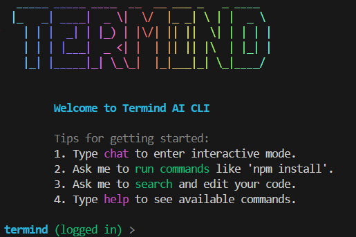

# 🧠 Termind CLI 


Termind is an **AI-powered terminal assistant** engineered with a robust **client-server architecture**. It allows users to interact with the codebase, refactor files, and run commands using natural language, all within a secure CLI environment.



---


## 🏗️ System Architecture

The application handles complex state and logic by separating the interface from the execution engine.

### 1. The Backend ("The Brain")
A Node.js/Express service that acts as the central orchestrator.
*   **API Design**: Exposes RESTful endpoints for the CLI to consume.
*   **State Management**: Uses **Prisma** and **PostgreSQL** to persist user sessions.


### 2. The CLI ("The Body")
A lightweight TypeScript client optimized for interactivity.
*   **Interactive REPL**: Built with `commander` to provide a seamless, chat-like experience in the terminal.
*   **State Sync**: Maintains local session context while synchronizing critical data with the backend.

---

## 🛠️ Technology Stack

*   **Runtime**: Node.js & TypeScript
*   **Backend Framework**: Express.js
*   **Database**: PostgreSQL
*   **ORM**: Prisma
*   **CLI Libraries**: Commander.js, Chalk
*   **AI Integration**: OpenRouter / OpenAI SDKs

---

## ✨ Key Features

### 1. 🔍 Context-Aware Exploration
Termind can explore your project structure on its own.
- **List & Search**: It can recursively search for code patterns (`search` tool) or list directory contents (`list_dir`), so you don't have to copy-paste snippets.
- **Deep Reading**: It reads file contents to understand logic before suggesting fixes.

### 2. 🛠️ Autonomous Coding
- **File Editing**: Can create new components or refactor existing files.
- **Execute Commands**: Can execute `npm install`, `git status`, or run test suites directly from the chat.

### 3. 💬 Interactive Chat
- A persistent REPL session (`termind`) where you can type `chat` to enter a loop.
- **Session Memory**: Remembers context *within* the current session (cleared on exit).
---

## 📦 Getting Started

### Prerequisites
*   Node.js v18+
*   PostgreSQL
*   API Key (OpenAI or OpenRouter)

### Installation

1.  **Clone the repository**
    ```bash
    git clone https://github.com/AyushSahu1306/termind.git
    cd termind
    ```

2.  **Backend Setup**:
    ```bash
    cd backend
    npm install
     # Create a .env file with your API keys (see .env.example)
    npm run build
    npm run dev
    ```

3.  **CLI Setup**:
    ```bash
    cd cli
    npm install
    npm run build
    npm link
    ```

### Running It
Once both are set up:

1. Open your terminal in **ANY** project you want to work on.
2. Run:
   ```bash
   termind
   ```
3. Inside the interactive session:
   - `login`: Authentication via GitHub.
   - `chat`: Enter the AI Chat Mode.
   - `exit`: Quit.